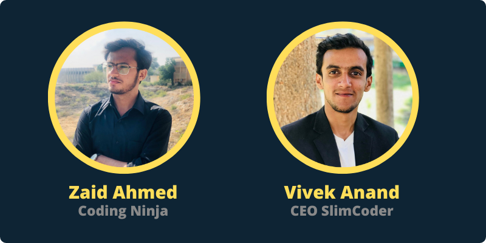

 
<h2>What is Webstar?</h2>

Webstar is a 3-Days web development boot-camp in which two expert web developers will speak. This bootcamp is organized by Software Engineering Society, a local IEEE body of Department of Software Engineering MUET. The purpose of this bootcamp is to guide freshers for their journey of web design and development.

 
 
<h2>What is MERN Stack?</h2>

MERN is a free and open-source JavaScript software stack for building dynamic web sites and web applications. The stack contains of MongoDB, Express.js, React.js, and Node.js. This is one of the most popular web development stacks in JavaScript. It uses a noSQL database, a JavaScript framework and runtime for creating a web server, and library that provides virtual DOM and state management for frontend development. 

 
<h2>Our Speakers</h2>

  
<h2>Participants and Contributors</h2>

